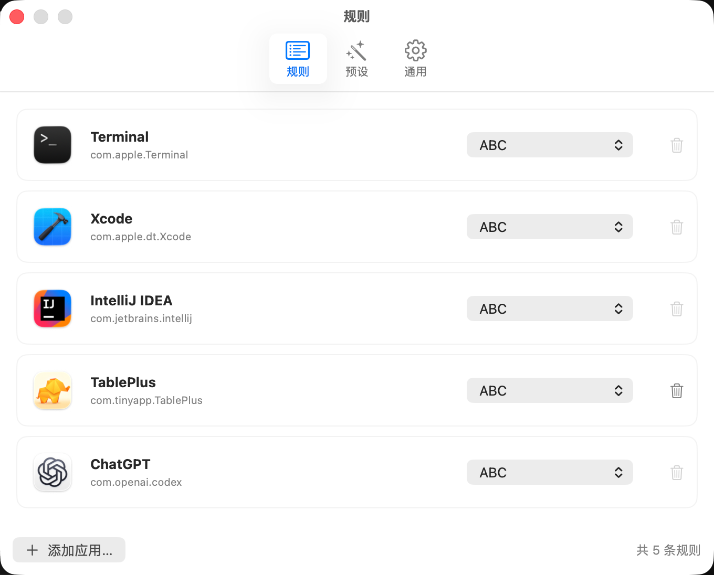
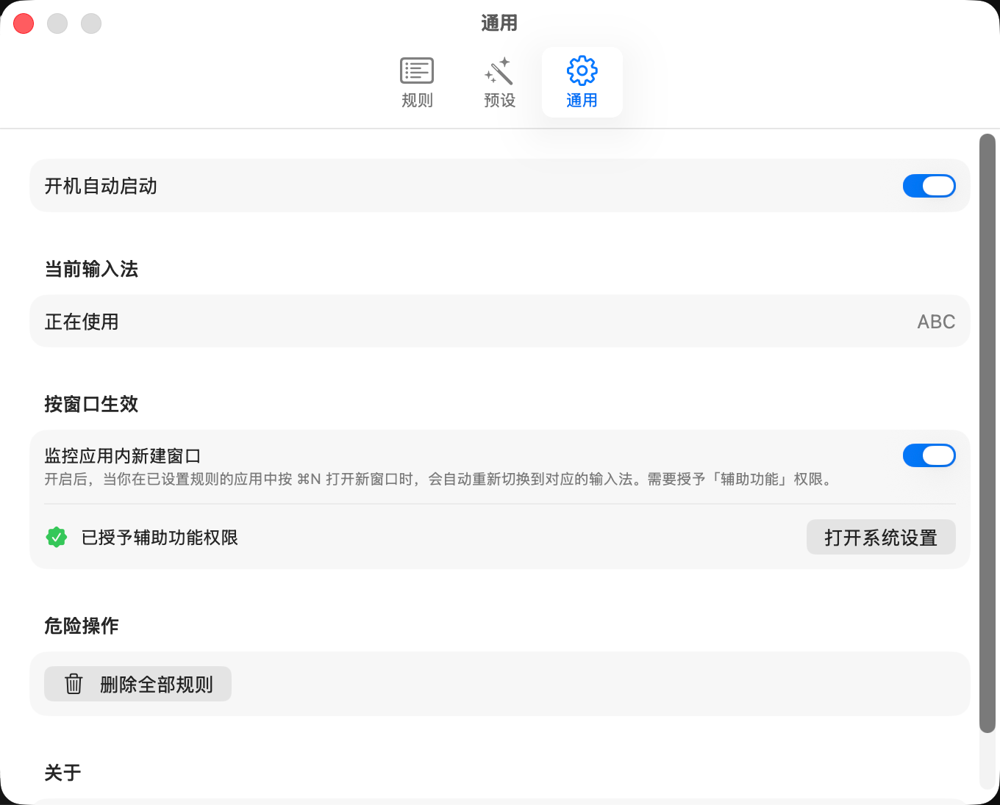
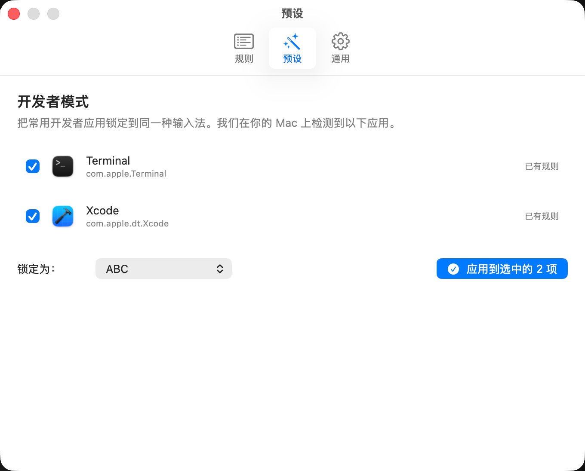

# InputLock

InputLock 是一款 macOS 菜单栏应用：为不同应用设定输入法，并在切换应用或切换窗口时自动应用对应规则。

## 功能

- 为任意已安装应用绑定一个已启用的 macOS 输入法。
- 前台应用切换时自动切换输入法。
- 可选的窗口级规则执行：同一应用中新窗口获得焦点时也会重新应用规则。
- 首次启动时可识别 Terminal、iTerm、Visual Studio Code、Xcode 和 Ghostty，并快速创建规则。
- 支持开机自动启动。
- 菜单栏显示当前输入法、前台应用的规则状态和最近规则。

## 界面截图

| 菜单栏 | 规则 |
| --- | --- |
|  |  |

| 通用设置 | 开发者预设 |
| --- | --- |
|  |  |

## 系统要求

- macOS 14.0 或更高版本
- Xcode 15 或更高版本

## 构建与运行

1. 使用 Xcode 打开 `InputLock.xcodeproj`。
2. 选择 `InputLock` scheme 和本机作为运行目标。
3. 按下 `⌘R` 构建并运行。

应用启动后驻留在菜单栏。

## 使用方法

1. 先在「系统设置 → 键盘 → 输入法」中启用要使用的输入法。
2. 打开 InputLock 的「设置」，添加应用规则并选择目标输入法。
3. 若要在同一应用的不同窗口间切换时也确保规则生效，请在「隐私与安全性 → 辅助功能」中授权 InputLock。
4. 可按需开启「开机自动启动」。

## 隐私

InputLock 不包含网络请求或数据上传逻辑。规则仅保存在本机的 `UserDefaults` 中；应用会在本机读取前台应用和已启用输入法，以应用你配置的规则。

## 许可证

当前仓库尚未指定开源许可证。公开仓库不等同于授予他人使用、修改或分发代码的许可；如需开源发布，请添加合适的 `LICENSE` 文件。
